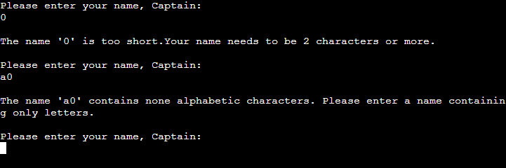

# A Simple Terminal Based Battleshop Game

[View the live project here](https://simple-battleship-game-59e68049f437.herokuapp.com/)

## Project overview

This is a web game engineered using Python and deployed via Heroku in which the player challenges the computer. The primary focus is to be able to easily and conveniently play a simple game of Battleship. The target users for the game are people interested in playing online and real-world games. A prime focus of the user experience (UX) is to be able to immediately play the game. In this version of Battleship the aim of the game is for the player to correctly guess the location of the computer's hidden battleship before they run out of turns (12) and the game ends.

Battleship is a strategy type guessing game for up to two players. It is ordinarily played on ruled grids  where each player's fleet of battleships are marked. There are player vs player or player vs computer versions with varying degrees of difficulty that are informed by number of ships, board size, number of turns or other factors. The locations of the ships are concealed from the other player. Players alternate turns by selecting coordinates in an attempt to hit another player's ships, and the objective of the game is to destroy all of the opposing player;s ships. Battleship was originally paper game which dates from World War I and published in the 1930s. In 1967 is was released as a plastic board game by Milton Bradley before making the transition to digital formats later in the century. More information on Battleships can be found [here on Wikipedia](https://en.wikipedia.org/wiki/Battleship_(game)).

## User Experience(UX)

- ### User Stories
- #### First Time Visitor

  1. I want to easily understand the app purpose and play the game.
  2. I want to access information on background and rules of the game.
  3. I want to be able to navigate through the app and be prompted when repeating target selections, choices out of range or when entering incorrect input.

- #### Returning Visitor

  1. I want to achieve the above goals more quickly, fluidly and intuitively.
  2. I want to be able to immediately play a game.
  3. I want to access the developers other library of projects.

- #### Frequent Visitor

  1. I want to be able to immediately play a game.

## Existing site features

- F01, F02 Load out and player name selection

This is the app loadout where a player will be initially oriented to. Once the app runs the player is prompted to enter a name from a nautical themed prompt (player is referred to as 'Captain' to improve UX.) There is also input validation for the user name that prompts the user to only enter a name made up of alphabetic characters (i.e. no numbers or special characters) as well as ensuring that their name is 2 or more charcters in length.

- F02 Welcome & main game information screen

Here the player is welcomed in an again nautical stylised manner. They are informed of the game rules and how to play the game. There is also a legend to inform as what the symbols represent within the game. The player's name is passed through from the initial input stage and referred to in the welcome loadout as 'Captain X', so as to again provide a contextualised UX. A blank board is shown to the player which is where the computer's ship will be hidden and the player has to guess. The border is styled to frame the information and make the welcome page more appealing. The rules and information for the game can be found in the screen shot included in this READ.ME.

- F04, F05 & F06 Selection input, validation, turn and board update

A function runs to randomly generate a hidden computer ship location on the board. The player is prompted to make a selection of the row to take their turn followed by selection of a column. The player must enter a number between 0 and 4 respectively. Validation takes place to ensure that the player enters a number with an error messaged displayed if this is not the case. If the entries are validated and other conditions are not met (repeat/not within range) then the board updates with an 'X' to show the coordinate selected and the number of turns counter is reduced by 1. Turns only decrease on correct selections, not when the same entry is made or a selection out of range. The display resets (referred to later in the feature section and then the player is prompted to enter a new row and column selection.)

- F07, F08 & F09 Miss, out of range and same selection output

If the player's selection is validated within range (previous feature) but it does not hit the hidden ship coordinate then this is registered as a miss and an 'X' is marked on the board. The number of turns remaining is updated to decrease by 1. The message is timed to display before clearing and the game view resetting for the next player turn. The player selection is also validated as to whether it is between 0 and 4 as this is the indexing of the 5 x 5 board grid. If the selection is a negative number or greater than 4 then the 'out of range' output is displayed and the player is prompted to try another selection. The output is timed to display before clearing and the board resetting. If the player makes the same coordinate selection more than once then validation of the input triggers an output to inform them of this occurence. The output is time to display and then clear to reset the game view for the next turn. The 'turns remaining' are not updated in either instance where a player makes the same or out of range selection. The outputs are given a jovial, nautical theme to improve UX and keep the player challenged whilst not frustrating them.

- F10 Computer ship sunk and replay option

If the player guesses the correct row and column location of the computer ship within the assigned number of turns and this is not a repeat or out of range selection then the player wins and the game loop breaks. An output to indicate that the player has won is shown, pulling through the ship location and number of turns remaining to provide some game statistics for the player if they wanted to challenge themselves in the future (replayability and UX consideration). A message prompt is displayed asking the player if they wish to play again (by entering y that is set to not be case sensitive) or if they wish to quit (pressing any other button). Selecting play again clears the terminal and resets the game, prompting the player to enter their name again and restarting the main game function. If they elect to quit then the game exits and closes within the terminal. A message is displayed in a jovial, nautical style if the player exits to thank them for playing and indicate that the game is ending. The exit message pulls through the players name to improve engagement and UX.

- F12 Game over/loss output

If the player is not able to correctly select the computer ship within the 12 turns and the turn counter runs down to zero then they have lost the game and the computer has one. The game displays an output to indicate this and pulls through the correct coordinates of the ship for better UX and continued engagement so that they can understand their choices made. A message prompt is displayed asking the player if they wish to play again (by entering y that is set to not be case sensitive) or if they wish to quit (pressing any other button). Selecting play again clears the terminal and resets the game, prompting the player to enter their name again and restarting the main game function. If they elect to quit then the game exits and closes within the terminal. A message is displayed in a jovial, nautical style if the player exits to thank them for playing and indicate that the game is ending. The exit message pulls through the players name to improve engagement and UX.

## User story interaction with features

The app has been designed to work through the anticipated ranking of need and desires of users from first time visitors to regular users, recognising needs and wants differ. The design and priority of features is intended to provide the information that users would require to make play the game and make an emotional connection to the nautical gaming world. 

## Features for future consideration and development

- Inclusion of a player board that the computer is making guesses against in order to sink the player ship
- The ability for the player to set the location of their ship if this is an option
- The ability to set the difficulty of the game by varying the number of ships, size of the board, a turn timer or the number of turns
- Addition of labels for row and columns and adjustment of the index to start at '1' rather than zero

## Design

### Theme

Throughout the game a nautical, lighthearted theme has been employed in the language used to improve the UX and give a contextual experience to the game, promoting engagement and replayability for the user.

### Flowchart design

A flowchart model developed on [Lucid chart](https://www.lucidchart.com/pages/) was used to model the procedural flow of the game. The final deployment differs slightly to this as adjustments were made during development.

### Model

The model employed was based on procedural functions to request, handle, validate and return data from the player the triggers subsequent sequences of the game stages. The functions are called within the main game function, where while and if else loops are used to validate input data and update stages of the game, including outputs. As each function is executed this either returns information or prints and updates elements within the terminal. 

## Technologies employed

### Development languages

- [Python](https://en.wikipedia.org/wiki/Python_(programming_language))

### Libraries, frameworks and programs

- [Code Anywhere](https://codeanywhere.com/): this was used for version control via the terminal to commit to Code Anywhere and Push to GitHub as the repository.
- [GitHub](https://github.com/): this was used as a repository for projects that were committed from Code Anywhere.
- [Tiny PNG](https://tinypng.com/): this was used to compress files for inclusion.
- [Am I responsive](https://ui.dev/amiresponsive): used to test responsivity of site.
- [Lucid chart](https://www.lucidchart.com/pages/): used to create a flowchart model of the programme.
- [Heruko](https://www.heroku.com/): used to deploy the programme.
- [Code Institute Linter](https://pep8ci.herokuapp.com/): used to check the Python code against PEP8 standards.

## Validation

- The site has been validated in [Code Institute Linter](https://pep8ci.herokuapp.com/). The Python is valid at the time of writing as demonstrated below:

PEP8 errors that were corrected before launch included:
- Removal of whitespace;
- Reduction in size of code line length to less than 80 characters;
- The use of a generic "_" variable in place of an "i" unused variable;
- Over or under indentation issues.

## Scenario testing and results

The following details the tests that were set out and completed for the site:

# Known bugs

- Within Code Anywhere there is a warning notification of "Import statements do not load in parallel". This has been explored with support and is understood to relate to potential perforaance issues if there were a style sheet opened or linked to the style sheet within this project. As this is not a feature of this project, the warning is not thought to be significant at this time.
- It has been noted that occasionally on some mobile devices the outcome section can overlay the results sectionw when the endgame message is displayed. This has been styled to avoid with CSS but the problem intermittently persists so will be revisited.
- The formatting of the header has been noted to not layout correctly on one mobile device, despite styling to correct.

## Deployment

### Deployment of site

- In the GitHub repository, select the Settings tab;
- Select the Pages tab from the left hand menu;
- Under the branch section select 'main' branch. This will display a message to indicate deployment if completed successfully;
- Any subsequent changes to the project will take effect on the live page;
- A live link to the functional site can be found here [View the live project here](https://mattuw4.github.io/Rock-paper-scissors-JavaScript-game/).

### Cloning the repository

- Navigate to the repository <https://mattuw4.github.io/Rock-paper-scissors-JavaScript-game/> on GitHub;
- Above the list of files, click Code;
- Copy the URL for the repository by selecting HTTPs;
- Open Git Bash;
- Change the current working directory to the location where you want the cloned directory;
- Type 'git clone', and then paste the URL you copied earlier;
- Press Enter to create your local clone.

### Forking a project

- A fork is a new repository that shares code and visibility settings with the original “upstream” repository.
- On GitHub.com, navigate to the relevant repository;
- In the top-right corner of the page, click Fork;
- Under "Owner," select the dropdown menu and click an owner for the forked repository;
- By default, forks are named the same as their upstream repositories. Optionally, to further distinguish your fork, in the "Repository name" field, type a name;
- Optionally, in the "Description" field, type a description of your fork;
- Optionally, select Copy the DEFAULT branch only;
- For many forking scenarios, such as contributing to open-source projects, you only need to copy the default branch. If you do not select this option, all branches will be copied into the new fork;
- Click Create fork.

### Any change made to the site should be committed and pushed to GitHub within your IDE terminal

- Using the 'Git Add' command move files to the staging area;
- Using the 'Git Commit' command take a snapshot of the current state of your repository;
- The git commit command requires a commit message that describes the snapshot/changes that you made in that commit;
- Use the 'Git Push' command to push the files to the GitHub repository;
- As the site is live changes will take effect there.

## Credits

### Content

- All content was written by the developer for this site. Styling and layout are the users own work.

### Code

Within the code files there are comments to indicate where the below resources were used as a basis to inform the code that was ultimately produced to style the site.

- Code on how to use flex box and implement for ordering purposes was informed by resources from [CSS Tricks](https://css-tricks.com/snippets/css/a-guide-to-flexbox/).
- Tutorials on how to develop a rock, paper, scissors were referred to and are available at [Web Dev Simplified](https://www.youtube.com/watch?v=1yS-JV4fWqY), [Geek for geeks](https://www.geeksforgeeks.org/rock-paper-and-scissor-game-using-javascript/), [Mozilla Development Network](https://developer.mozilla.org/en-US/docs/Web/JavaScript) and [Code with Faraz](https://www.codewithfaraz.com/content/107/create-rock-paper-scissors-game-with-html-css-and-javascript)
- A tutorial on how to create a modal was used to develop the modal page [W3Schools](https://www.w3schools.com/howto/howto_css_modals.asp)
- The Love Maths project from the Code Institute was also used to inform development of the JavaScript

### Media

- The icons used in the modal and refresh buttons taken from [Font Awesome](https://fontawesome.com/)
- The font used across the site was taken from [Google Fonts](https://fonts.google.com/)
- All images were accessed from [Swampview](https://swampview.com/rock-paper-scissors-lizard-spock-rules/): this was used to access images for the rock, paper, scissors hands. All credit for these images goes to Tony Florida. This site is not for commercial purposes, only educational.

## Acknowledgements

Thanks to my mentor Brian Macharia who provided essential, indispensible reassurance and input with the project development and implementation.

This game was engineerd as my second project with [Code Institute](https://codeinstitute.net/).